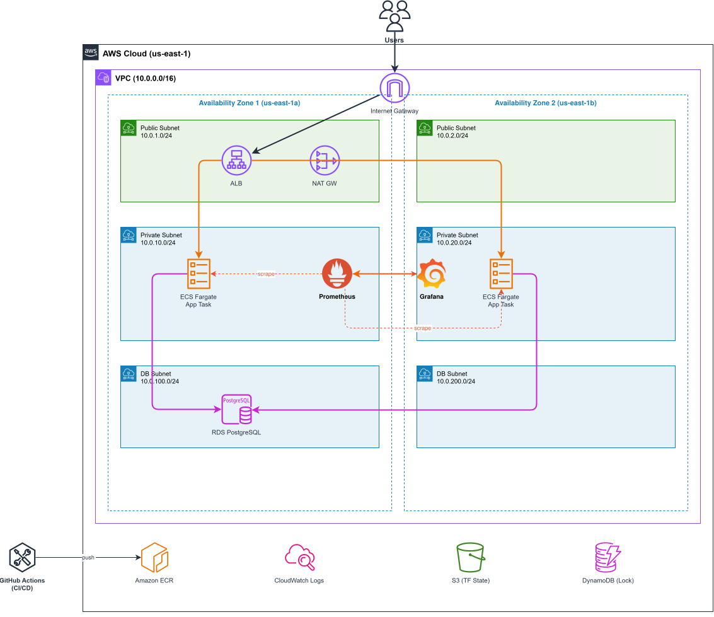

# Automated Infrastructure Deployment and Monitoring on AWS

A fully automated DevOps pipeline demonstrating Infrastructure as Code, CI/CD, and Monitoring as Code on Amazon Web Services.

## Architecture



| Layer | Components |
|-------|-----------|
| Public | ALB, NAT Gateway, Internet Gateway |
| App Tier | 2x ECS Fargate Tasks (FastAPI) across 2 AZs |
| Monitoring | Prometheus (scraping), Grafana (dashboards) |
| Database | RDS PostgreSQL (private, isolated) |
| CI/CD | GitHub Actions with OIDC authentication |

## Tech Stack

- **Cloud:** AWS (ECS Fargate, ALB, RDS, ECR, VPC, Cloud Map)
- **IaC:** Terraform (51 resources, remote S3 state)
- **App:** Python 3.11, FastAPI, SQLAlchemy, Uvicorn
- **CI/CD:** GitHub Actions (OIDC, zero stored credentials)
- **Monitoring:** Prometheus + Grafana (deployed as code)
- **Containers:** Docker (multi-stage builds)

## Project Structure

```
├── app/                        # FastAPI application
│   ├── main.py                 # API endpoints + Prometheus metrics
│   └── database.py             # SQLAlchemy models + DB config
├── terraform/                  # Infrastructure as Code
│   ├── main.tf                 # Provider, backend, variables
│   ├── networking.tf           # VPC, subnets, IGW, NAT, SGs
│   ├── ecs.tf                  # ECS cluster, task defs, services
│   ├── alb.tf                  # Load balancer, target groups
│   ├── rds.tf                  # PostgreSQL database
│   ├── monitoring.tf           # Prometheus + Grafana (ECS)
│   ├── iam.tf                  # Roles, OIDC provider
│   ├── ecr.tf                  # Container registry
│   └── outputs.tf              # ALB DNS, ECR URLs, endpoints
├── monitoring/
│   ├── prometheus/             # Prometheus config + Dockerfile
│   └── grafana/                # Grafana provisioning + dashboard
├── .github/workflows/
│   └── deploy.yml              # CI/CD pipeline
├── Dockerfile                  # Multi-stage app container
└── docs/                       # Architecture diagrams
```

## Quick Start

### Prerequisites
- AWS CLI configured (`aws configure`)
- Terraform >= 1.5
- Docker

### Deploy

```bash
# 1. Provision infrastructure
cd terraform
terraform init
terraform apply

# 2. Build and push app image
aws ecr get-login-password | docker login --username AWS --password-stdin <ECR_URL>
docker build -t <ECR_URL>:latest .
docker push <ECR_URL>:latest

# 3. Build and push monitoring images
cd monitoring/prometheus && docker build -t <PROM_ECR>:latest . && docker push <PROM_ECR>:latest
cd ../grafana && docker build -t <GRAF_ECR>:latest . && docker push <GRAF_ECR>:latest

# 4. Force ECS redeployment
aws ecs update-service --cluster devops-project-cluster --service devops-project-service --force-new-deployment
```

### Endpoints

| Service | URL |
|---------|-----|
| App | `http://<ALB_DNS>/` |
| Swagger UI | `http://<ALB_DNS>/docs` |
| Grafana | `http://<ALB_DNS>:3000` (admin/admin) |
| Health | `http://<ALB_DNS>/health` |
| Metrics | `http://<ALB_DNS>/metrics` |

### Tear Down

```bash
terraform destroy
```

## CI/CD Pipeline

Every push to `main` triggers:

1. **OIDC Auth** → Assumes AWS role (no stored secrets)
2. **Build** → Docker image tagged with commit SHA
3. **Push** → Image sent to ECR
4. **Deploy** → ECS task definition updated, rolling deployment (~4 min total)

## Monitoring

- Prometheus auto-discovers containers via AWS Cloud Map DNS
- Grafana pre-provisioned with dashboard showing:
  - HTTP Request Count & Rate
  - Database Latency (avg + P95)
  - DB Query Count
- Zero manual configuration on scale/redeploy

## License

This project was developed as a graduation project at Al-Balqa Applied University.
